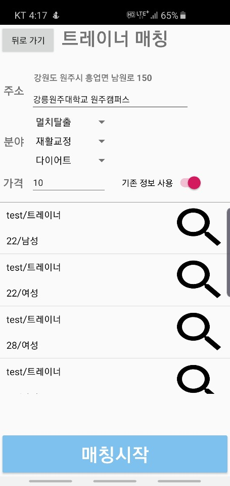
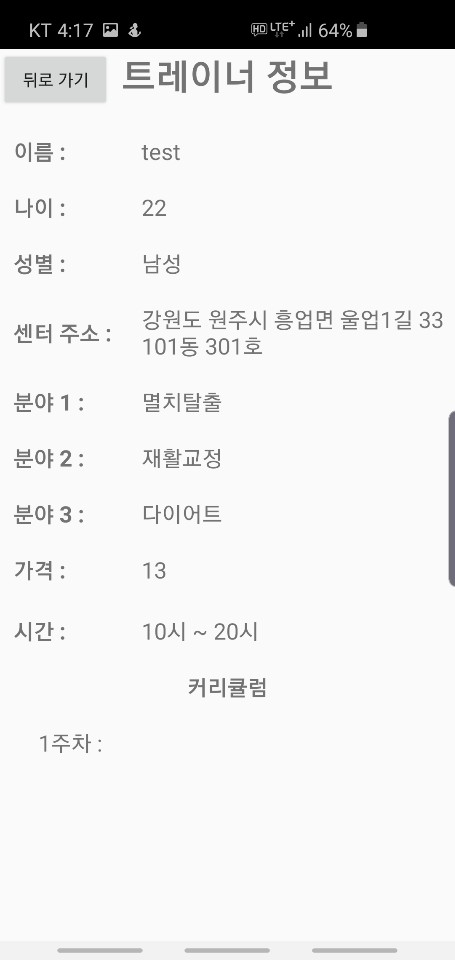
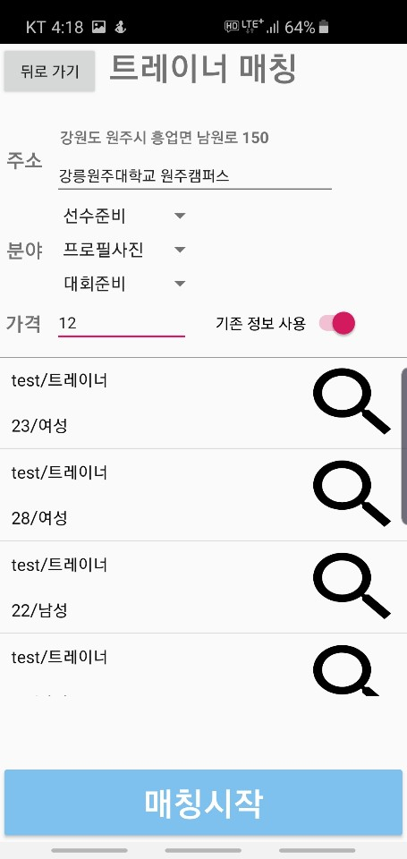
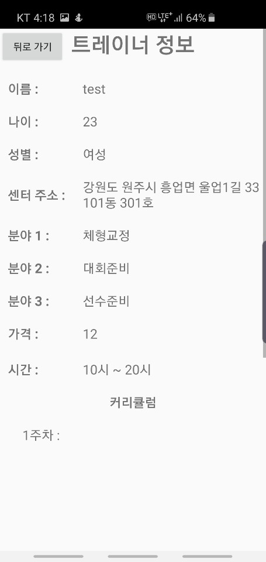
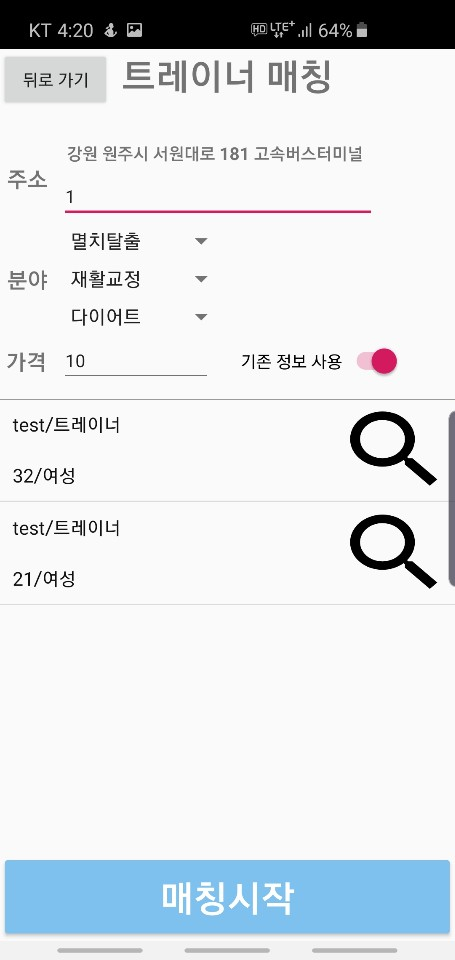
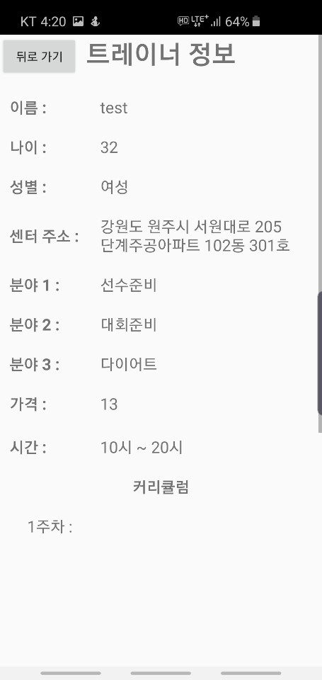

### README.md

- 프로젝트 HEALLELUJAH는 아마존 AWS를 이용하여 만들어졌습니다.
- 프로젝트 HEALLELUJAH는 아마존 RDS를 이용하여 만들어졌습니다.
- 프로젝트 HEALLELUJAH는 헬스  안드로이드 어플리케이션입니다.

**1. 프로젝트 개요**

**1-1 프로젝트 동기**

- 2018년 기준으로 대한민국의 성인 비만율은 34.8%에 육박합니다. 매우 높은 수치이며 정부에서도 국가 첫 비만관리 종합대책을 내세울 정도입니다.
- 대한민국의 생활체육 참여율은 해를 거듭할수록 증가하고 있으며, 그중에서도 생활체육 종목에서 상위에 있는 종목은 걷기, 등산, 보디빌딩이 있습니다.
- 생활체육 관련 강습 및 강좌 경험율은 30%이며 수영, 보디빌딩, 요가가 상위권에 있습니다.

**1-2 담당 업무**

- 김규형 : 애플리케이션 백엔드 제작
- 김재원 : DB 설계 및 PHP 제작
- 박태규 : PHP 제작 및 매칭 알고리즘 제작
- 지유진 : 애플리케이션 디자인 및 프론트엔드 제작

**2. 프로젝트 설명**

- 헬스회원과 트레이너를 나눠 회원가입이 가능하게 합니다.
- 트레이너는 자신의 헬스 트레이너 정보를 등록할 수 있습니다.
- 헬스회원은 자신이 원하는 트레이너의 정보를 입력하여 매칭 알고리즘을 통해 검색이 가능하게 합니다.

**3. 프로젝트 알고리즘**

- 매칭 알고리즘을 위해 필요한 정보는 총 6가지로, 회원의 희망분야 1지망, 2지망, 3지망과 앞에서 변환한 주소의 위도와 경도, 그리고 회원이 희망하는 가격입니다.
- 매칭 알고리즘에 필요한 위도와 경도는 주소를 이용하여 좌표로 변환하는 구글 클라우드 플랫폼의 Geocoding API를 이용하였습니다.
- 회원이 입력한 희망분야 1지망, 2지망, 3지망을 파이썬 딕셔너리를 이용하여 변환을 해줍니다.
  - ex) 린매스업 -> 1
- 회원의 위도와 경도를 기준으로 반경 3km 이내의 트레이너들만을 DB에서 검색합니다.
- DB에서 트레이너의 주요분야 1번, 2번, 3번과 트레이너의 횟수당 가격을 출력합니다.
- 트레이너의 주요분야 1번, 2번, 3번을 변환을 시켜줍니다.
- 변환된 값을 하나의 문자열로 만들어주는데 이때 1지망은 3회, 2지망은 2회, 3지망은 1회 중첩을 하여 문자열로 변환을 시켜줍니다.
  - ex) 1지망 : 1, 2지망 : 2, 3지망 : 3 - > '111223'
- 문자열들과 회원의 희망 가격, 트레이너의 횟수당 가격을 이용하여 유사도를 계산합니다.
  - 파이썬에 내장된 두 문자열 사이의 유사도를 계산하는 함수를 이용하여 두 문자열 사이의 유사도를 계산합니다.
  - 희망 가격과 횟수당 가격중 작은 값을 큰 값으로 나눠 계산합니다. 
  - 위에서 구한 두 값의 합을 계산하여 유사도를 출력해 냅니다.
- 계산된 값을 트레이너의 아이디를 키 값으로 하여 딕셔너리에 저장하여 검색된 결과에 대해 모든 계산이 끝나면 이를 내림차순으로 정렬하여 출력합니다.

**4. 알고리즘 테스트**

**4-1. 테스트 데이터**

이름 | 분야1 | 분야2 | 분야3 | 가격 | 주소 | 비고
---- | ---- | ---- | ---- | ---- | ---- | ----
test1 | 멸치탈출 | 재활교정 | 다이어트 | 10 | 강원도 원주시 흥업면 남원로 150 | 기본
test2 | 선수준비 | 프로필사진 | 대회준비 | 12 | 강원도 원주시 흥업면 남원로 150 | 정보수정
test3 | 멸치탈출 | 재활교정 | 다이어트 | 10 | 강원도 원주시 서원대로 181 고속버스터미널 | 위치변경
 
- 매칭 알고리즘을 테스트하기 위해 총 3개의 데이터를 준비해 했습니다.
- 가장 기본이 되는 멸치탈출, 재활교정, 다이어트, 10만원, 강릉원주대학교 원주캠퍼스의 데이터를 갖는 test1입니다.
- test1과 비교하여 분야와 가격을 다르게 한 test2입니다.
- test1과 비교하여 분야와 가격은 동일하지만 거리가 다른 test3입니다.

**4-2. 테스트 결과**

 

- test1의 경우 가장 유사한 트레이너의 정보를 가진 멸치탈출, 재활교정, 다이어트, 13만원으로 입력이 된 22세 남성과 가장 높은 유사도를 가집니다.

 

- test2의 경우 선수준비, 프로필사진, 대회준비, 12만원 순으로 입력이 되어 있습니다.
- 이와 가장 유사한 트레이너의 정보를 가진 체형교정, 대회준비, 선수준비, 12만원으로 입력이 된 23세 여성 트레이너와 가장 높은 유사도를 가지게 됩니다.

 

- test3의 경우 기존의 검색된 트레이너들의 위치보다 멀리 떨어진 상황에서 비교를 하게 되어 기존의 트레이너들은 검색이 되지 않습니다.
- 그렇기에 선수준비, 대회준비, 다이어트, 13만원의 정보가 입력되어 있는 32세 여성 트레이너와 가장 높은 유사도를 가지게 됩니다.
